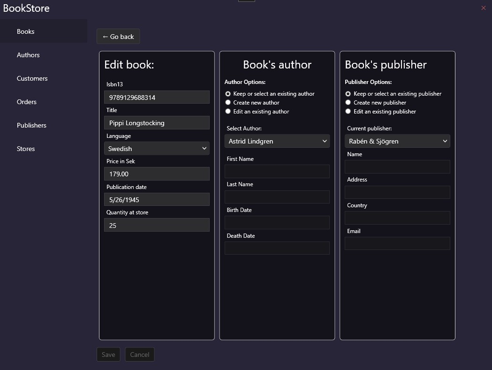
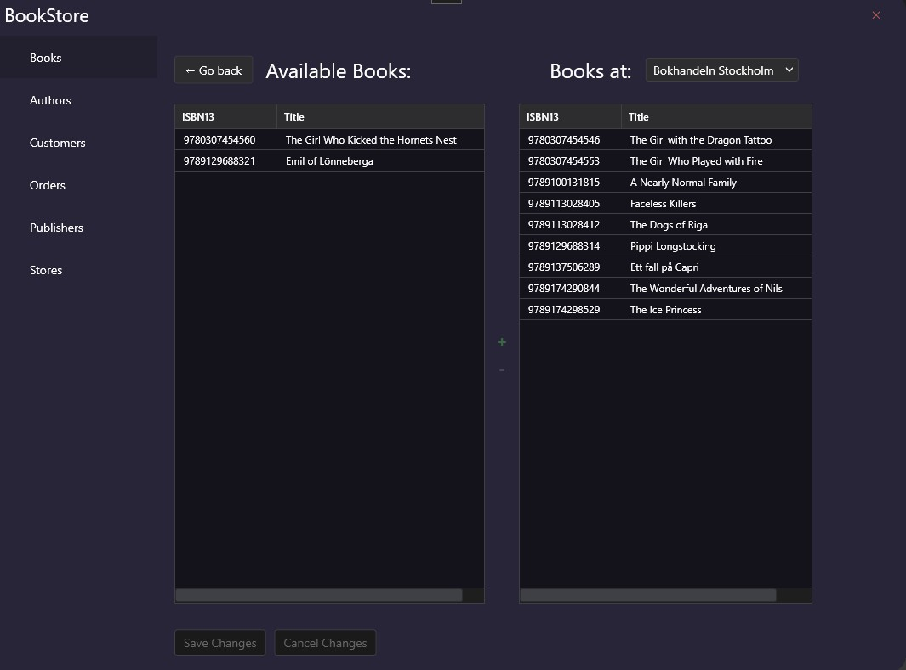

# BookStore app
An app built for a school project at IT-Högskolan in Gothenburg where I study to become a C# Developer, we were tasked to build a database-first application with WPF as the framework to display and manipulate the data in the Database.

A Clean listing of all books at the selected store.


Editing of books is simple, and from here also the Author and Publisher of the book can be edited or added.


Even moving inventory is made simple.


## requirements
* .NET 8
* SQL-Server (I have tested both SQL Server 2022 and 2025, both works.)
* EF Core
  
## How to run
1. Clone the repo
2. Restore the DB (must currently be provided by me as a "backup")
3. Setup a UserSecret in the .Infrastructure, with the Database `Labb2BookstoreDB` , localhost, integrated security with TrustServerCert true. Should look something like this:
```
{
	"ConnectionString" :  "Data Source=localhost;Database=Labb2BookstoreDB;Integrated Security=True;TrustServerCertificate=True;"
}
```
